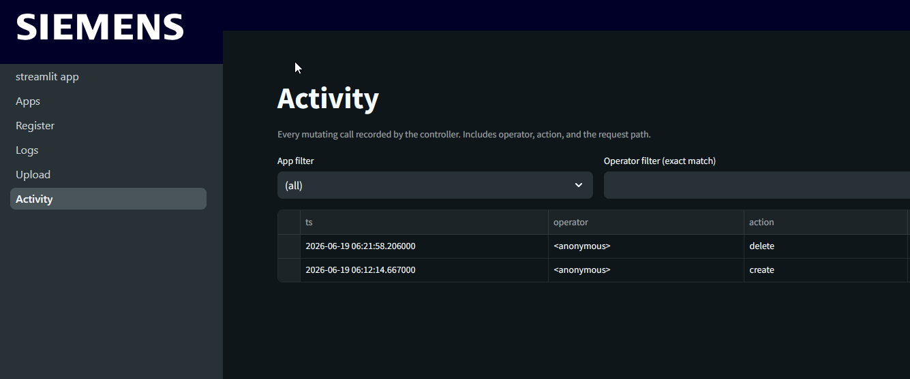
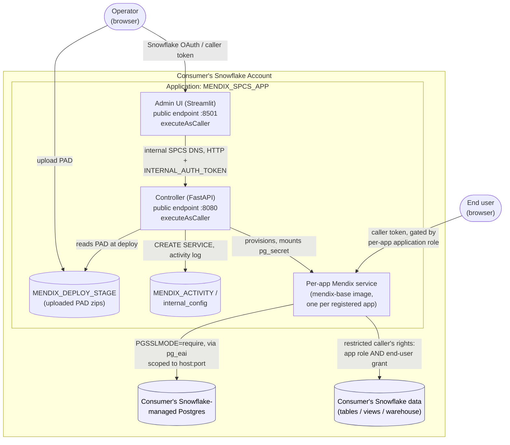

# Mendix on Snowpark Container Services

Run Mendix applications natively on Snowflake using Snowpark Container Services (SPCS). No Mendix Cloud, no Kubernetes operator, no external infrastructure. The Mendix runtime runs as a container inside Snowflake, connected to a Snowflake-managed Postgres database, with file storage on Snowflake stages. Users authenticate via Snowflake identity and can query Snowflake data as themselves.

## Screenshots

The optional [Streamlit admin UI](#admin-ui-optional) manages apps from a browser, themed to Siemens iX:

**Apps overview** — service and deploy status for every app you own, with refresh and bulk actions.


**Register a new app** — provisions the SPCS service, filestorage stage, and secrets; sets the owner role and resource tier.


**Service logs** — tail any app's logs, plus the controller's and admin UI's own logs for privileged operators.


**Activity** — an audit log of every mutating operation (deploy, suspend, resume, constants/spec edit, delete), recording the operator, action, target app, and outcome.



## What This Is

A controller-based deployment toolkit for running Mendix apps on SPCS:

- **Controller** (`Controller/`) - A FastAPI service that runs inside SPCS and manages the full app lifecycle: provisioning services, storing constants as Snowflake secrets, and deploying new PAD versions without Docker rebuilds per app.
- **`upload-pad.ps1`** - The operator-facing deploy script. Uploads a Mendix PAD zip to the Snowflake stage and calls the controller API to trigger a deploy. No Docker build required per deploy.
- **`setup.ps1`** - One-time infrastructure setup: creates the controller role, secrets, stage, app registry table, and controller service.
- **Admin UI** (`Admin UI/`) - Streamlit-based admin frontend that runs as a sibling SPCS service. Calls the controller over internal SPCS DNS and lets operators manage apps from a browser. Pages: app status and lifecycle (deploy, suspend, resume, delete), PAD upload, constants editor, logs, activity audit log, and a privileged Infrastructure page for compute pool resize. Multi-tenant: each app carries an `owner_role` and operators see only apps owned by roles they hold.
- **Mendix Base Image** (`Mendix Base Image/`) - A generic Mendix runner image. Built once and shared across all apps. No app code baked in — the app is loaded from the stage at container startup.
- **SnowflakeSSO module** - Mendix module that reads the `Sf-Context-Current-User` header injected by SPCS, auto-logs users in using their Snowflake identity, and captures the caller token for querying Snowflake data as the end user.
- **[mendix-spcs-howto.md](mendix-spcs-howto.md)** - Full setup and deployment guide.
- **[mendix-spcs-caveats-and-ideas.md](mendix-spcs-caveats-and-ideas.md)** - Known limitations and future work.

## Architecture

Packaged as a **Snowflake Native App with Containers** (`native-app/`):



- **Admin UI and Controller** both run with `executeAsCaller` (restricted caller's rights) and are
  gated by a Snowflake caller token; the Admin UI → Controller hop additionally requires a shared
  `INTERNAL_AUTH_TOKEN` generated at install.
- **Per-app Mendix services** (one per registered app) are the only components with external
  egress — scoped to the consumer's own Postgres `host:port` via the bound `pg_eai` reference, no
  broader network access.
- **Consumer Snowflake data access** uses Snowflake's two-layer restricted caller's-rights model:
  a query succeeds only when both the application object and the calling end user hold the grant.
- See [native-app/HOW-TO-PUBLISH.md](native-app/HOW-TO-PUBLISH.md) for the release/install runbook
  and [native-app/app/readme.md](native-app/app/readme.md) for the consumer-facing setup guide.

## Prerequisites

- Mendix Studio Pro 10.24.19+ or 11.6.5+ (Portable App Distribution export)
- Snowflake account with ACCOUNTADMIN access
- Snowflake CLI (`snow`) 3.x+
- PowerShell 5.1+

## Quick Start

Full one-time setup is in [mendix-spcs-howto.md](mendix-spcs-howto.md). The short version:

1. Build and push the `mendix-base` image once (shared across all apps)
2. Run `.\Controller\setup.ps1` to provision the controller infrastructure
3. Build and push the `mendix-deploy-controller` image, then wait for the controller service to reach RUNNING (see the howto, Step 4)
4. For each app, export a Portable App Distribution from Studio Pro and run:

```powershell
.\Controller\upload-pad.ps1 `
  -AppName "my-app" `
  -PadPath "C:\path\to\MyApp_portable_20261201.zip" `
  -ControllerUrl "https://<controller-ingress>.snowflakecomputing.app" `
  -Token "<controller-pat>" `
  -Config ".\Controller\controller-config.json" `
  -AppConfig "C:\path\to\my-app-config.json"   # first deploy only
```

Subsequent deploys omit `-AppConfig`. The script uploads the PAD to the Snowflake stage, triggers the controller, and polls until the app is READY.

## Deploying a New Version

No Docker build. Export a new PAD from Studio Pro and run `upload-pad.ps1` without `-AppConfig`:

```powershell
.\Controller\upload-pad.ps1 `
  -AppName "my-app" `
  -PadPath "C:\path\to\MyApp_portable_20261215.zip" `
  -ControllerUrl "https://<controller-ingress>.snowflakecomputing.app" `
  -Token "<controller-pat>" `
  -Config ".\Controller\controller-config.json"
```

## Querying Snowflake Data

Mendix microflows can query Snowflake tables using the logged-in user's identity (caller's rights). The SnowflakeSSO module captures a compound token (service + user), which authenticates JDBC connections over the internal Snowflake network. No EAI or external egress needed for this path.

See [mendix-spcs-howto.md](mendix-spcs-howto.md) for setup details.

## File Storage

Files uploaded through Mendix land on a Snowflake stage and are immediately queryable:

```sql
LIST @YOUR_DB.PUBLIC.MYAPP_FILESTORAGE_STAGE;
SELECT $1 FROM @YOUR_DB.PUBLIC.MYAPP_FILESTORAGE_STAGE/export.csv (FILE_FORMAT => 'csv_format');
```

## Cost

SPCS compute pools charge per hour of runtime. A CPU_X64_S pool costs 0.11 credits/hour. The compute pool auto-suspends when all services are suspended (`AUTO_SUSPEND_SECS = 3600`). See the howto for scheduled suspend/resume task examples.

## Known Limitations

- SPCS endpoints get a fixed `<hash>-<account>.snowflakecomputing.app` URL — no custom domains
- Snowflake Postgres network policy must be updated when SPCS egress IP ranges rotate (current expiry: 2026-09-07)
- Trial Mendix license terminates the runtime after ~2 hours; a production license requires egress to `licensing.mendix.com`
- Caller's rights tokens expire after 30 minutes; the SnowflakeSSO refresh snippet must be present in the Main Layout

See [mendix-spcs-caveats-and-ideas.md](mendix-spcs-caveats-and-ideas.md) for the full list.
